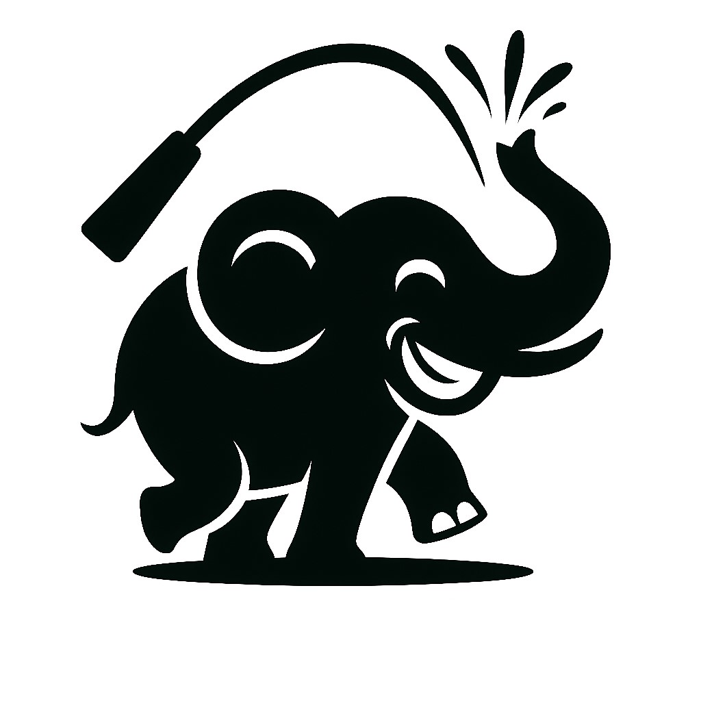
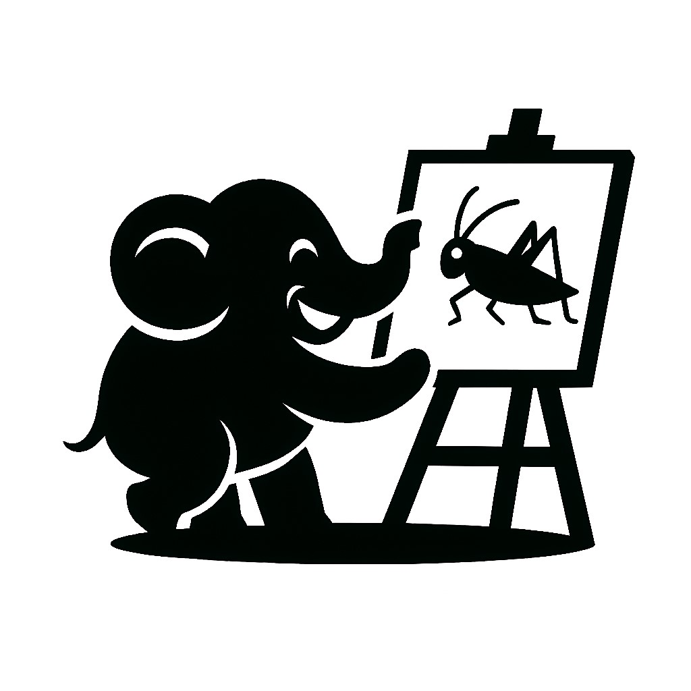

# 《玄学是科学吗？》讲者笔记 | Speaker Notes for "Is Divination Science?"

## 基本信息 | Basic Information
- 讲座标题：玄学是科学吗？ | Lecture Title: Is Divination Science?
- 日期：2025年8月22日 | Date: August 22, 2025
- 时长：总计 120 分钟（90 分钟演讲 + 10 分钟中场休息 + 15–20 分钟 Q&A） | Duration: 120 minutes total (90-minute talk + 10-minute break + 15–20-minute Q&A)
- 目标受众：多层次的跨学科公众——包含理工/人文社科领域的学者与研究生、产业从业者与创业者、对“传统文化 × 科学方法 × 决策”有兴趣的普通听众，以及已退休或长期脱离专业训练的朋友；零基础亦可听，欢迎不同立场参与理性讨论。 | Target Audience: A multi-layered, cross-disciplinary public—including STEM & HSS scholars and graduate students, industry practitioners & entrepreneurs, general audience interested in “traditional culture × scientific method × decision-making,” and retirees/out-of-practice learners; no prior background required, open to diverse viewpoints.
- 主讲人：张子阳 (衔瑜) 博士 | Speaker: Dr. Zhang Ziyang (Xianyu)
- 语调：接地气、克制而专业；用生活化的有趣实例解释抽象概念；尊重证据、不过度渲染；适度幽默但不打断逻辑。 | Tone : Conversational and grounded, yet professional; explain abstract ideas with relatable real-life examples; evidence-minded with no hype; light, appropriate humor without derailing the logic.
- 幻灯片总数：16张 | Total Slides: 16

---

## 讲座大纲 | Lecture Outline
> 总讲时 90 分钟：上半场至第 8 页；下半场为第 9–16 页；中间休息 10 分钟；最后 Q\&A 15–20 分钟。
> Talk time 90 minutes: Part I through Slide 8; Part II Slides 9–16; 10-minute break in between; 15–20-minute Q\&A at the end.

Slide 1 标题页 / Title — 2′
Slide 2 分享大纲 / Outline — 3′
Slide 3 什么是玄学（聚焦术数）/ What is “Metaphysics” (Numerology focus) — 10′
Slide 4 什么是科学 / What is Science — 12′
Slide 5 “科学的尽头是玄学吗？” / Is Science’s End Metaphysics? — 9′
Slide 6 练习：生肖断点 / Exercise: Zodiac Boundaries — 2′
Slide 7 农历与节气 / Lunisolar Calendar & Seasons — 4′
Slide 8 阶段小结 / Interim Summary — 3′
   小计 / Subtotal：45′

— 中场休息 Intermission：10′ —

Slide 9 五行与网络 / Five-Element Networks — 3′
Slide 10 四柱与子平法 / Four Pillars & Ziping — 12′
Slide 11 命/象/调的区分 / Fate vs. Symbols vs. Adjustment — 9′
Slide 12 误差来源与学科视角 / Error Sources & Disciplinary Views — 9′
Slide 13 伦理与边界 / Ethics & Boundaries — 7′
Slide 14 复盘要点 / Review & Guidelines — 3′
Slide 15 延伸资源和结语 / Extended Resources and Conclusion — 2′
    小计 / Subtotal：45′

> 时间结构总览 | Timing at a Glance
> 45′（1–8）＋10′ 休息/Rest ＋45′（9–16）＋15–20′ Q&A = 115–120′

---

## 逐页演讲稿 | Slide-by-Slide Script

### Slide 1：标题页 | Title Slide

#### 主要内容（2分钟）
各位晚上好，先谢谢主办方与承办团队，也谢谢在场所有朋友、以及志愿者的辛苦。
我是张衔瑜，理工出身，主要做医学工程和 AI 交叉。今晚不站队，我们就事论事：用清晰的定义、证据、校准把问题讲明白。

在座的各位，谁没有在人生的十字路口犹豫过？考研还是工作、分手还是复合、买房还是等等再说... 这时候，你们是怎么做决定的？

有人说"算一卦吧"，有人说"看星座运势"，有人说"问问爸妈"，还有人说"抛硬币决定"。我想请大家先在心里给出直觉答案——

- 你和你同学，同年同月同日生，他考上了研究生你没考上，这是"命"的问题吗？
- 你妈说这个月不适合结婚，你信吗？如果你信了，是因为怕真的不顺，还是因为不想和妈妈吵架？
- 打开手机App算命，和找个老师傅算命，哪个更靠谱？还是说，都一样不靠谱？
- 如果真的有"命中注定"，那我们每天还努力个什么劲儿？

这些问题看似简单，但背后其实藏着一个更大的问题：玄学和科学，到底是什么关系？

<small>补充：开场用发问是经典的演讲策略，属于 Monroe’s Motivated Sequence 的“注意—需要”两步，可有效把听众拉到同一问题上。今晚也会不时借用 Carl Sagan 的 Baloney Detection Kit 来做“去伪存真”的思维工具。从人类学看，占卜/卜筮不仅是“算未来”，还承担诊断、给出规训与安放不确定性的社会功能，这有助于理解它为何让人“觉得有用”。</small>

---

### Slide 2：分享大纲（标语：不要把孩子和洗脚水一起倒掉） | Lecture Outline (Slogan: Don't throw away the baby with the bathwater)

#### 主要内容（3分钟）
刚才那些问题，是不是很熟悉？相信在座的各位，多多少少都遇到过类似的纠结。今晚我们就一起来聊聊这个话题。

整体安排很简单：上半场，我们先搞清楚什么是玄学、什么是科学，它们的边界在哪里；中场休息十分钟，大家可以消化一下；下半场，我们深入聊聊具体的做法——比如算命是怎么算的、为什么有时候"准"有时候"不准"、我们应该怎么看待这些东西。最后留时间给大家提问。

先给大家打个预防针：玄学这个东西，说它全是迷信吧，好像也不完全对；说它是科学吧，又明显不是。就像我们老说的那句话——不要把孩子和洗脚水一起倒掉。

举个例子，大家都听过"相克"这个词吧？比如"水火不容"。其实想想也有道理——你拿水泼火，火当然灭了。但是，水和火离得老远，怎么相克？而且，水火相遇，有时候是灭火，有时候是蒸汽，有时候甚至能发电。所以关键不是"克不克"，而是在什么条件下、以什么方式相遇。

今晚我会用这样的思路，带大家看看玄学背后的逻辑，把有道理的部分留下来，把没道理的部分扔掉。

---

### Slide 3：什么是玄学（本讲缩义＝“象数”与“术数”） | What Do We Mean by “Xuanxue” Here?

#### 主要内容（10分钟）
说到玄学，大家脑子里可能冒出各种词：算命、看相、风水、占卜... 其实这些都对，但又不完全对。

简单来说，我们今天聊的"玄学"，主要指的是一套"看模式、找规律"的方法。就像你看到乌云密布，就知道可能要下雨；看到某个朋友最近总是熬夜，就知道他可能压力很大。玄学也是这样，通过一些符号、象征来推测事情的发展。

比如大家熟悉的：
- 算命：根据出生时间推算人的性格和运势
- 看相：从长相特征判断性格和命运
- 风水：通过环境布置影响运气
- 占卜：用硬币、卦象等方式来决策

这些方法有个共同特点：都是"看图说话"——给你一个图案（可能是八卦、可能是手相、可能是房子的朝向），然后告诉你这意味着什么。

现在问题来了：这个"看图说话"到底靠不靠谱？

就像我刚才说的抛硬币，硬币本身没什么神奇的，它就是个随机数发生器。但是，如果你给每个结果配上一段解释，它就开始"讲故事"了。正面代表"顺利"，反面代表"困难"，这样硬币就变成了"神谕"。

关键是：这个故事有没有道理？这就需要我们用科学的方法来检验了。

今天我们重点聊的是这种"象数化"的术数方法，不涉及那些更玄乎的东西，比如请神、通灵什么的。那些咱们先放一边，有兴趣的朋友可以私下交流。

<small>补充：术数为何“看起来有用”？一方面依托长期的时间与环境编码（如节气/物候），另一方面靠解释框架降低不确定性；两者都可能让结果“更像那么回事”。但像不等于真——后文会用“可检验与校准”的准绳筛一遍。
若需哲学脉络：魏晋“玄学”与英文 Neo-Daoism 对应；而“metaphysics”在西方语境即“形而上学”的常用译名，二者语义层级不同，别混用。
简单来说，象数学意味着“红灯停、绿灯行”，你是怎么意识到红灯停，绿灯行的？</small>

---

### Slide 4：什么是科学（自然 / 社会 / 形式） | What is Science (Natural / Social / Formal)
那什么是科学呢？简单来说，科学就是一套"验证方法"。

*自然科学（物理、化学等）*
你说水的沸点是100度，那我们就真的烧水试试看。你说苹果会往下掉，那我们就真的扔个苹果看看。关键词就是：能重复、能验证。如果你的理论经不起检验，那就得改改了。

*社会科学（经济、心理、社会学等）*
研究人的行为和社会现象。比如有人说"风水好的房子更贵"，那我们就去看看房价数据，统计一下是不是真的这样。结果发现，还真有这个现象——不过这可能不是因为风水真的有用，而是因为很多人相信风水。

这就引出一个重要区别：玄学本身不是科学，但研究玄学的社会影响可以是科学。

*形式科学（数学、逻辑等）*
这个有点抽象，简单说就是"推理游戏"。在一套规则里，只要逻辑没问题，就能得出结论。但是，逻辑正确不等于现实正确。就像你可以逻辑完美地证明"如果所有猫都会飞，而Tom是猫，那么Tom会飞"，但现实中猫根本不会飞啊。

科学的基本要求：
- 公开透明：方法要公开，别人能重复你的实验
- 可以质疑：如果有新证据，理论就要修改
- 实事求是：以事实为准，不是因为权威说了什么就是什么

回到我们的话题：玄学和科学的关系是什么？

我的看法是：玄学不全是科学，但也不全是迷信。它更像是一种"启发式思考"的工具。就像你做决定时问朋友意见一样，不是因为朋友的话一定对，而是多个角度看问题可能有帮助。

关键是：别把启发当成真理，别让"看图说话"替代了实际的证据。

<small>补充：
* 别撒太多梗。
* 提到占星时*克制*：说“经典双盲并不支持”，立刻补一句“欢迎看数据与协议”。</small>

---

### Slide 5：科学的尽头是玄学吗？——更接近"真相"的可检验表述 | Is Science's End Metaphysics? — Testable Statements Closer to "Truth"

#### 主要内容（9分钟）
前段时间网上很火一个说法："科学的尽头是玄学"。这话听起来很高深，但仔细想想，真的是这样吗？

我们先澄清两个概念：

什么是"真相"？简单说，就是事情的本来面目。但问题是，我们永远看不到100%的真相。为什么？

想想你的眼睛：只能看到很窄的一段光谱，红外线、紫外线都看不到；你的耳朵也一样，超声波、次声波都听不见。所以我们对世界的认识，本来就是有限的。

再说，我们的大脑还会"补脑"。大家都见过那种视觉错觉的图片吧？明明一样长的两条线，看起来却不一样长。这说明我们的感知不完全可靠。

那怎么办？科学的做法是：虽然看不到全貌，但可以一点一点逼近真相。就像盲人摸象，虽然每个人摸到的不一样，但大家的信息合起来，就能对大象有个比较准确的认识。

所以科学的目标不是找到"绝对真理"，而是在现有条件下，尽可能接近事实。

那为什么有人说"科学的尽头是玄学"呢？我觉得主要有两个原因：
1. 一些搞科技的人，在研究的边界遇到了解释不了的现象，就开始怀疑科学
2. 一些搞玄学的人，想给自己"包装"得高大上一点

但实际上，无论遇到什么解释不了的现象，我们的态度应该是：能实验的就实验，不能实验的也要把逻辑和证据讲清楚。

比如你看新闻说"明天下雨的概率是80%"，你会带伞吗？大部分人会带，因为虽然不是100%确定，但80%的概率已经足够让我们做决定了。这就是科学的思维方式：在不确定中寻找相对的确定。
观测受“理论/仪器前加载”：我们不是直接“看见事实”，而是借模型与设备在看。→ 每个结论配“对象—测量—协议—模型”四件套。

测量永远带不确定度（GUM）：结果=估计值±不确定度，且需交代来源与合成方法。→ 幻灯与手册统一误差条与写法。

证据不足与“可多解”（Underdetermination）：同一证据常支持多个解释。→ 少说“定论”，多说“在当前证据下更优，还需哪些新证据来区分”。

启发式与偏差（System 1/2）：快思考高效，慢思考校验。→ 团队里设**“唱反调”角色**，把快思用于生假设、慢思用于查证。

见证/媒体的脆弱性：大型研究显示虚假信息传播更快更广。→ 关键决策用多源独立核验+时间戳+原始方法链接。

“无免费午餐”：没有放之四海皆准的最优算法/方法；性能来自问题—模型匹配。→ 明确先验与适用域，做外部验证。

自然层面的“不可同时知”（物理极限提醒）：位置与动量的联合确定度受海森堡原理限制。→ 把“极限”写清楚，别怪到“仪器不行”。</small>

---

### Slide 6：练习题——生肖的断点（时间—历法—体系差异） | Exercise: Zodiac Boundary Points (Time-Calendar-System Differences)

现在我们来做个小测试，看看大家对玄学的理解。

大家都知道自己的生肖吧？那我问几个问题：
- 如果你是1月3日出生的，你属什么？是属龙还是属蛇？
- 如果你是1月30日出生的呢？
- 如果你正好是立春那天晚上出生的，比如2月3日晚上10点，你属什么？

这个问题有意思在哪里？同样是2025年出生的人，有的人可能属龙，有的人可能属蛇，关键看你用什么标准。

有人说按阳历算，有人说按农历算，还有人说按节气算。你看，连生肖这么基础的东西，都有不同的标准。这说明什么？说明玄学并不是铁板一块的"真理"，而是一套有人为约定成分的系统。
<small>**补充**：无。</small>

---

说到历法，这里就更有意思了。我们现在用的农历，其实是个很复杂的系统。

它不是纯粹的阴历（只看月亮），也不是纯粹的阳历（只看太阳），而是"阴阳合历"——既考虑月亮的圆缺，又考虑太阳的位置。为什么要这样呢？

因为古人需要同时解决两个问题：
1. 生活节奏：看月亮定日子，月圆月缺有仪式感
2. 农业生产：看太阳定季节，春种秋收不能错

所以你看，连历法这个看起来很"玄"的东西，背后其实都有很实用的考虑。古人不是无聊才发明这些的，而是为了解决实际问题。

二十四节气就更明显了：立春、雨水、清明、谷雨...这些名字一听就知道是干农活用的。什么时候播种，什么时候收割，都有讲究。

所以黄历上那些"宜"什么"忌"什么，核心目的是协调大家的行为。比如"今天不宜嫁娶"，可能就是因为大家都在忙农活，没空办婚礼。这样就避免了资源冲突。
- 农历是阴阳合历：月相节律（阴）与太阳周年（阳）叠加；黄历承载生产与民俗时令。比如红白喜事不要在路上撞一起，其实就是规定一下不要干相互冲撞的活。
- 二十四节气与“七十二候”是古人对时间—气候—物候的系统编码。

<small>**补充**：节气在“择时”与“调候”中的角色：把“气候平均—当地偏差—个体适应”连接到具体选择与健康节律。</small>

---

### Slide 8：阶段小结（后半场议题提示） | Interim Summary (Second Half Topics Preview)

好，上半场我们聊了这些：

1. 玄学是什么？一套"看模式、找规律"的方法，核心是"看图说话"
2. 科学是什么？一套验证方法，追求可重复、可检验
3. 它们的关系？玄学不是科学，但可以作为启发式思考的工具
4. 要注意什么？别把启发当真理，别让"看图说话"替代实际证据

看起来挺清楚的，对吧？但是现实中，事情往往比理论复杂。

比如：
- 为什么有些算命师看起来"很准"？
- 命真的能算吗？算出来了能改吗？
- 什么时候应该相信玄学，什么时候应该用科学？

休息十分钟，下半场我们就来聊聊这些更具体的问题。大家可以想想，有什么关于算命、风水、占卜的问题，等会儿可以一起讨论。
<small>**补充**：随机应变。</small>

---

  
      
  

  <h1>中场休息</h1>

  
      
  

---

### Slide 9：五行与相关网络（木火土金水） | Five Elements and Related Networks (Wood-Fire-Earth-Metal-Water)

大家都听过"五行"吧？金木水火土。但是在玄学里，它们不是简单的五个元素，而是一套相互作用的关系网络。

比如大家熟悉的：
- 水生木（浇水能让树长得更好）
- 木生火（木头能烧火）
- 火生土（烧完了留下灰烬）
- 土生金（从土里能挖出金属）
- 金生水（金属表面会结露水）

这是"相生"的关系。但还有"相克"：
- 水克火（水能灭火）
- 火克金（火能融化金属）
- 金克木（斧头能砍树）
- 木克土（树根能松土）
- 土克水（土能吸水）

听起来很有道理，对吧？问题是，现实中事情没这么简单。

水真的总是克火吗？如果水太少、火太大呢？如果是油火呢？
木真的总是生火吗？如果木头是湿的呢？

所以我最不喜欢听人说"我是木命"、"他是火命"。命哪有这么简单？一个人的性格、运势，怎么可能用一个字就概括了？

这就像说"我是A型血，所以我性格内向"。血型和性格可能有点关系，但绝对不是决定性的。环境、教育、经历、选择，这些都比血型重要得多。

五行的逻辑其实是在提醒我们：世界上的事物是相互影响的。但具体怎么影响，要看实际情况，不能一概而论。

### Slide 10：四柱八字与子平法（实务骨架） | Four Pillars and Ziping Method (Practical Framework)

#### 主要内容（12分钟）
现在我们来聊聊算命是怎么回事。大家可能听过"四柱八字"、"生辰八字"这些词，但具体是什么意思呢？

其实很简单：就是把你的出生时间，用一套古老的编码系统来表示。这套系统叫"干支纪年法"，用10个天干（甲乙丙丁戊己庚辛壬癸）和12个地支（子丑寅卯辰巳午未申酉戌亥）来记录时间。

你的出生时间包括四个部分：
- 年：哪一年生的
- 月：哪个月生的
- 日：哪一天生的
- 时：几点生的

每个部分都用一个天干和一个地支表示，所以总共8个字，叫"八字"。

比如今年是2025年，按干支就是"乙巳年"。如果你今年出生，这个"乙巳"就是你八字里的年柱。但是注意，这只是"背景信息"，不是决定性的。

算命师会根据这8个字，分析你的性格、运势等等。他们有一套复杂的规则，比如看哪个字最重要（日主），哪个月份出生影响最大（月令），五行之间怎么相互作用，等等。

听起来很玄，但本质上就是一套分类系统。就像现在的心理测试，根据你的答案把你归类为某种性格类型。区别是，算命用的是出生时间，心理测试用的是你的选择。

问题是：出生时间真的能决定性格和命运吗？

从统计学角度看，如果有影响，应该是很微弱的。想想看，全世界同一时间出生的人有多少？他们的人生轨迹一样吗？显然不是。

但这不代表算命完全没用。它的价值可能在于：提供一个思考框架，让你从不同角度审视自己。就像做性格测试，重要的不是结果有多准，而是测试过程让你反思了自己。

<small>**补充**：“正格/平格” 正官格、七杀格、正印/偏印格、食神格、伤官格、正财/偏财格、建禄格、阳刃格等；
根＝电源、同根＝同一电路、结根＝并联上电。通了电，器件才有“劲儿”。
有根（通根）：看日主（尤其）在四支里有没有自己的“根气”（禄/刃/长生/墓/余气等）或同类藏干——有根就有力。
同根：最佳是与月令同根（用神/格局之神与月令同源），常被称作“有力且有情”。
结根：本身根弱时，靠三合/三会把气“结成一气”，等于补了地基（如亥卯未合木、寅卯辰会木等，是否可用仍要看当令与清纯程度）。。</small>

---

### Slide 11：命可以改吗？——"命/象/调"的区分 | Can Fate Be Changed? — Distinction Between Fate/Symbol/Adjustment

#### 主要内容（9分钟）
现在来聊个大家都关心的问题：命能改吗？

这个问题，我用双胞胎的例子来解释最清楚。

大家想想，同卵双胞胎基因完全一样，如果按算命的逻辑，出生时间也一样（最多差几分钟），那他们的命运应该完全一样，对吧？

但现实是什么？双胞胎长大后，性格可能很不同，人生轨迹也经常南辕北辙。为什么？

生物学告诉我们答案：基因只是"底盘"，但最终的表现（我们叫"表型"）还要看环境。就像同样的种子，种在不同的土壤里，长出来的植物也会不一样。

科学研究发现，人的大部分特征，大概一半由基因决定，另一半由环境、经历、选择决定。而且随着年龄增长，环境的影响越来越大。

所以我的答案是：
- "命"（你的基因、出生环境）确实改不了
- 但"象"（你的具体表现、生活状态）是高度可调的

就像你买了一台电脑，处理器和内存是固定的（这是"命"），但你装什么软件、怎么使用，完全由你决定（这是"象"）。

那怎么"调"呢？我打个比方，把人生想象成一个调音台：

慢旋钮（基础设置）：睡眠、运动、饮食、居住环境——这些调整见效慢，但影响深远

快旋钮（日常管理）：时间安排、学习习惯、社交选择、情绪管理——这些今天调整，明天就有效果

所以算命有没有用？如果它能让你反思自己的状态，思考怎么调整，那就有用。如果它让你觉得"命中注定，无法改变"，那就有害。

回到最开始的问题：找AI算命和找老师傅算命有什么区别？区别可能不在准不准，而在于谁能给你更有启发的建议。

---

### Slide 12：卦不走空吗？——误差来源与学科视角 | Don't Hexagrams Fail? — Error Sources and Disciplinary Perspectives

#### 主要内容（9分钟）

你刚刚讲的是解卦，我觉得很有意思。也很符合科学逻辑。只是没有科学证明。
那有没有一天，玄学可以成为科学呢？或者能不能提出一些假说。

这个就很搞笑。如果卦准了，我可以这样给你解释；如果卦不准，我也可以这样给你解释。

自然科学：同步 & 多线索相关
- 人在车上常在“快到站”时醒——不是玄，而是睡中的大脑仍对显著信号敏感（减速、噪声/光线/路况的变化会诱发微觉醒与相位重置），所以“到点醒”更像多线索的同步触发。这说明很多“准头”来自同时性的线索聚合，未必是超验因果。

社会科学：人类认知的可预期偏差
- 巴纳姆/福勒效应：模糊而普适的描述，会被当成“为我量身定做”。经典实验把同一人格描述发给所有人，仍得到高“准确度”评分。
- 自利偏差：人更愿意接受正面、回避负面特质；这会“抬高”占测的主观命中率。Meta 分析显示该偏差广泛存在并受情境调节。
- 冷读/侧写：通过普遍经历与现场线索推断个体信息，塑造“被看穿”的错觉（典型技法见怀疑论与心理学文献）。

- Holbraad（古巴 Ifá）：把占卜视为在地知识实践，其“真”来自实践中的生成，而非单一对应。
- 马林诺夫斯基：在高不确定活动（远航、渔猎）中，仪式/占卜承担降焦虑与整合行动的功能。
- 阿占德神谕：为群体提供解释框架与规训，组织行动，降低不确定性。

形式科学：
- 符号系统可以内部自洽、可比较“解法优劣”，但凡声称经验命中，仍须外部可检验的证据（可证伪性是经典“划界”路标之一）。
- 那么小狗在想什么能不能算呢？当然可以，我们只是在讨论一个Object和另一个Object.

常见走空：
- 题目没立住（不疑何卜）：求测者不诚/信息不全，或问题本身含糊（问的是谁、哪个时间段、以什么口径判断“成与不成”）。
- 协议不清 & 沟通不畅：测时点、地理口径、验证标准未先约定，导致“同题不同口径”。
- 方法—精度错配 / 解卦链条断：
  - 起课法选错：
  - 时课系（如六壬）按时辰/干支立课，同分钟问事者可出现“群体同盘”，更适合群体/宏观事务；
  - 摇卦系（如六爻/易占）用随机投掷起卦，更强调个体差异与当事者参与；
  - 采样精度不足：求取方式粗糙、次数不足、时间戳误差大。
  - 解释链条不清：从“象 → 义 → 可检验主张”的转换缺失，或把普适描述当个案预言。

算命说：有一些人的命格是算不准的，大善人、大恶人、方外人。

<small>**补充**：若现场有人追问“那为什么网上看见‘到站前醒来就是玄学’？”——用睡眠中对显著刺激的处理与微觉醒回答，并提醒“相关≠因果”。
若有人说“符号系统自洽就是真理”：温和指出自洽是形式层的好性质；经验主张要过可证伪的关。
体脂秤、油耗、马力。</small>

---

### Slide 13：术数后传——伦理与边界 | Numerology's Legacy — Ethics and Boundaries

#### 主要内容（7分钟）
善易者不常卜。——另外一层意思是：频繁占卜，会损害我们用普通科学与常识解决问题的能力。什么事都要去问一下，如果问卦师，卦师每天要管到今天上班路上会不会出车祸。如果自己打，还不如看看高德地图导航。

反常识是：我家邻居是x教徒，我也跟着信了。所以一会儿给我治病用抗生素，不要用杀菌的。
于是我让他别喝白开水：那白开水也是蘑菇汤啊。——这叫名词陷阱：换词不等于换事实。

学界对“cult/邪教”概念长期有争议，不少社会学研究主张以“潜在危害/不受欢迎团体”描述，而不是一刀切标签——提醒我们既守法，也避免道德恐慌。

① 要你与家人朋友/主流信息隔离；② 以“天机/师命”否定医疗或法律义务；③ 以“捐赠/拜师费/玄物”交换“灵验”；④ 不许质疑、反对就贴标签；⑤ 承诺“包治百病/包办成败”。（①②在上面“法律红线”里已属高危。）

如果还有时间：
- “正缘是不是良缘？”正缘＝当下匹配度较高的人（象），良缘＝长期可持续的关系（事实+成本）。别把“相合”当“稳赢”，要回到沟通、健康与法律责任。
- “搞术数会消耗元神吗？”首先元神这个问题就不能这么问。其次。如果一定要这么问，搞术数跟做数学题差不多。注意力与睡眠被过度占用→执行功能与情绪调节变差。真正该防的是沉迷与依赖，而不是把一切交给“神秘能量”。

<small>**补充**：煤气灯：让当事人反复怀疑自己的记忆/判断，逐步失去自信。关键词：否认、误导、矛盾信息。强制劝说/思想改造的套路（学界总结）：制造不安→单一解释反复灌输→以“无条件接纳”换服从→重塑身份→隔离外界信息→严格日常控制。</small>

---

### Slide 14：复盘要点（方法框架与应用准绳） | Review Key Points (Methodological Framework and Application Guidelines)

#### 主要内容（3分钟）
- 今日要点：  
  1) 玄学与科学是不同层级方法；  
  2) 玄学不等于科学，但可作*象数化启发与情境建模*；  
  3) 一切经验性主张若要“进科学”，须给出可检验的预测与可复现的协议；  
  4) 实践中以*理性与边界意识*护航。
- 邀请现场提问与案例共创。

遵循自然科学研究的认知框架，启发式运用术数的方法论，来检验生活中的疑难与迷茫，从而引导趋吉避凶。

象数学是项超线性、多目标的风险预测决策，涉及了认知科学、系统科学和运筹学。

祝由：多说恭喜发财。

不要把孩子和洗脚水一起倒掉。

<small>**补充**：“模型皆错但可有用”的心态：把术当启发式，用证据与校准把有用留在手边。。</small>

---

### Slide 15：延伸资源与交流方式 | Extended Resources and Communication Channels

#### 主要内容（1分钟）
- *延伸阅读*（精选）：易学与术数经典；科学哲学入门；人类学的占卜研究；当代“类科学”讨论；神经科学与复杂性科学的若干综述。
- *交流*：邮箱/社媒（投屏中的二维码/链接）。  
- 建议把读书与小规模自建数据/日志结合，形成个人的“证据—校准”循环。

<small>**补充**：可抛给听众的问题：  
1) 若术数先验与数据概率冲突，谁让步？阈值如何定？  
2) 风水实验要多久/多贵才“足够”？  
3) 双胞胎的分化能否用“象可调”得到可操作解释？</small>

---

---

---

## 讲座实施指南 | Lecture Implementation Guide

### 演讲注意事项 | Speaking Guidelines

### 常见问题应对（示例口径） | FAQ Responses (Sample Approaches)

- **Q：学习玄学会不会影响科学思维？**  
  **A：** 二者可互补：精确计算用科学；整体把握用象数启发；**严禁**用术数替代医学/工程/法律判断。

---

## 使用说明 | Usage Instructions
- 每页包含三部分：  
  主要内容（讲什么）＋ 小字补充（由此页联想到什么）＋ 时间控制（见每页标题后括注）。  
- 讲述中尽量用贴近自然生活的例子。玄学本是讨论庸俗的学科。

  
  

