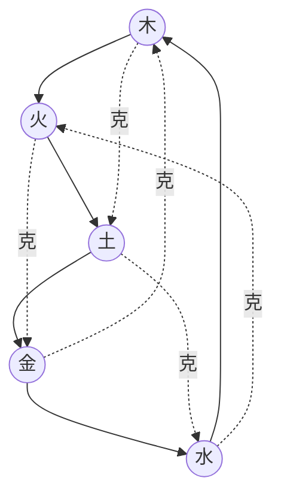

# 最简七步（示例占位）
1. 立柱（定盘）……
2. 看日主旺衰（强/平/弱）……
3. 先调候（寒热燥湿）……
4. 看格局是否成而清……
5. 取用/定忌（主用/佐用/忌）……
6. 一验证（大运为底色，流年为按钮）……
7. 五行→行动（90天小清单）……

::: callout-note
**口诀**（可替换）：寒先温，热先凉，燥先润，湿先燥；强则泄制，弱则生扶；大运是底色，流年是按钮。
:::

# 五行“生/克”关系图（Mermaid 快速版）
```{=html}
<!-- 若在某些环境需启用 mermaid，请在 Quarto 全局或本页启用 -->
```


> 需要更高质量/可控配色的图，请改用 `tikz/wuxing.pdf` 并在此处插图。

# 用神→行动映射（示例表）

| 五行 | 功能倾向（可编辑） | 行动例子（90天可执行） |
|---|---|---|
| 木 | 生长、学习、拓新 | 每周新增一个学习模块；日常拉伸；远景规划回顾 |
| 火 | 表达、体温、见光、社交 | 每日晨光10–20min；每周一次分享/演讲；日记输出 |
| 土 | 秩序、边界、收尾、稳定 | 看板收尾率≥80%；拒绝越界任务；固定复盘时段 |
| 金 | 规则、工具、裁剪、复盘 | 模板化常用流程；重构工具链；周复盘+删减 |
| 水 | 睡眠、补水、专注、移动 | 7.5h 睡眠；2L 饮水；远距离步行/短途旅行 |

# 口袋口诀（示例占位）
- 年看背景，月看气，日看我，时看舞台。
- 成格从格优先，清纯胜过堆料。
- 神煞当形容词，不当判决书。
- 结论需可验证，并标注前提条件（时间协议/时差/节令）。
